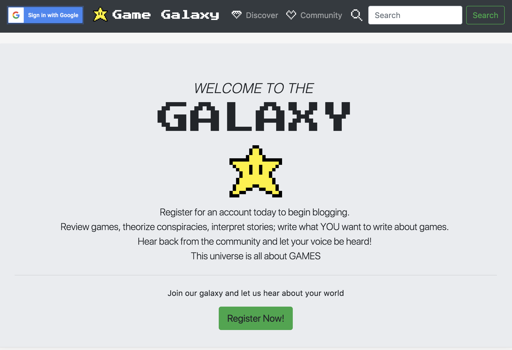
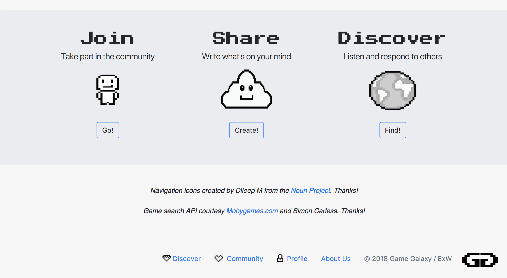
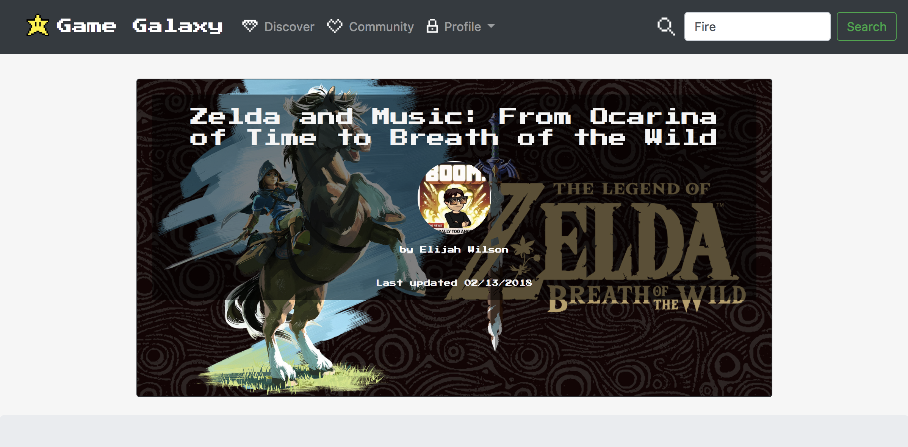
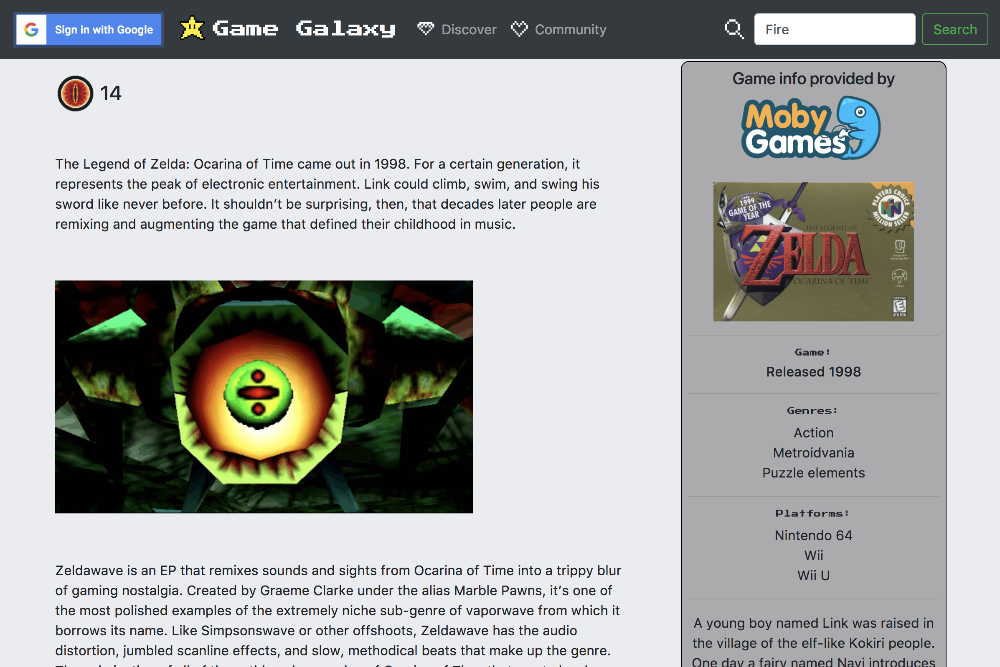
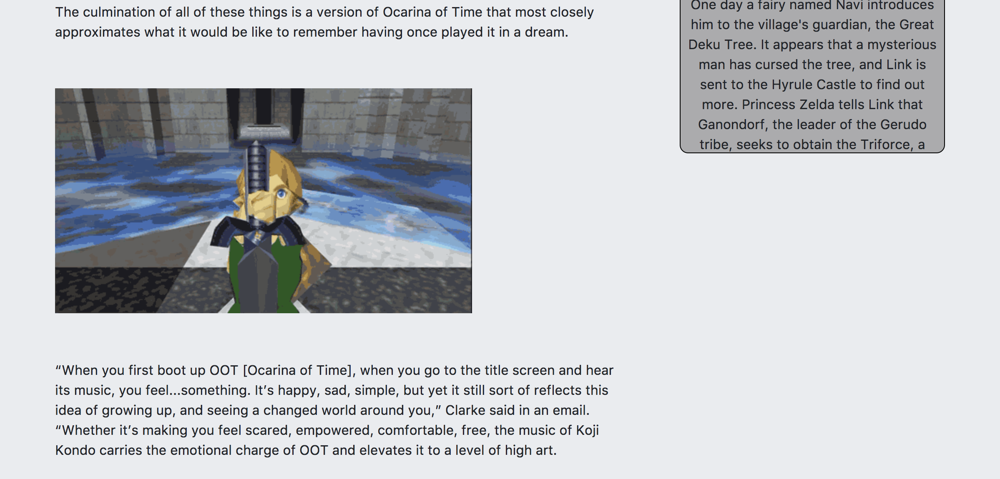
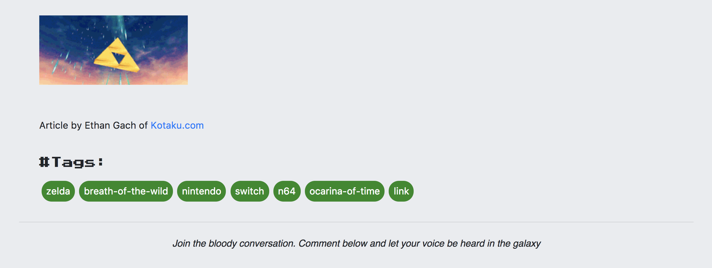
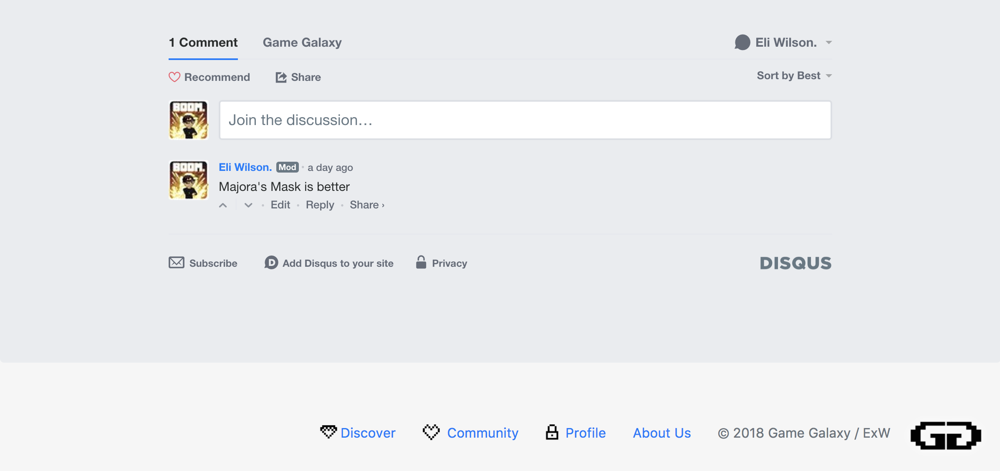

# * Game Galaxy *

Game Galaxy is a gaming-oriented blog where users can create and edit profiles, and create, edit and delete blog posts.

It is my Front-End Capstone for Nashville Software School.




# Tools:

- [x] HTML 
- [x] Sass 
- [x] Bootstrap 
- [x] Javascript 
- [x] JQuery 
- [x] AngularJS 
- [x] Firebase

# Libraries and Credits

KillerCodeMonkey's [ng-Quill Component](https://github.com/KillerCodeMonkey/ng-quill)

Michael Bromley's [Disqus Directive](https://github.com/michaelbromley/angularUtils/tree/master/src/directives/disqus)

Simon Carless and [MobyGames/MobyGames API](http://www.mobygames.com/)

[ngSanitize](https://docs.angularjs.org/api/ngSanitize)

Michael Benford's [ngTagsInput](http://mbenford.github.io/ngTagsInput/gettingstarted)

Dileep M's Pixel Icons from [The Noun Project](https://thenounproject.com/dil33pm/)

# Try it out

Visit https://galaxy-game-blog.firebaseapp.com/#!/home to try it out yourself

~ or ~

fork/download repo (requires npm, a local http server, and grunt) and...

```
cd game-galaxy
npm install
grunt
http-server
```

# Special Thanks

 - Joe, Emily, Jufe, and Greg for being incredible instructors and friends
 - All of C23 for being awesome as well as testing, feedback, and additional eyes
 - Guil for Treehouse for always being there for me
 - Ethan Gach of Kotaku for the example article below
 
# Example article:
 
 
 
 
 
 
 
